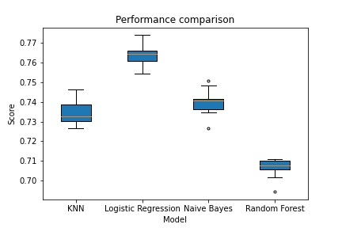
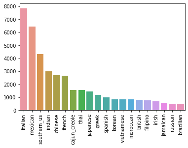
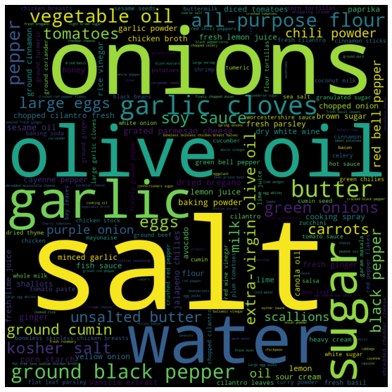

# Cuisine_Classification_ML

Code and artefacts related to an attempt to identify the cuisine type of a recipe based on its ingredients.

## Dataset
Kaggle - [Whats cooking?](https://www.kaggle.com/competitions/whats-cooking/data)

## Repository structure
* Pre-processing and EDA - [Jupyter notebook](preprocessingAndEDA.ipynb)
* Training and testing - [Jupyter notebook](trainingAndTesting.ipynb) 
* EDA with Pandas Profiling (hosted on Pages) - https://nutellaweera.github.io/Cuisine_Classification_ML/
* Exploratory scripts (experimentation with parameters, tuning using grid search/trial-and-error) - [/scripts](https://github.com/nutellaweera/Cuisine_Classification_ML/tree/main/scripts) folder.
  * [Helper/utility methods](scripts/utils.py)
  * [KNN](scripts/kNN.py)
  * [Multiclass Logistic Regression](scripts/multiclassLogisticRegression.py)
  * [Naive Bayes](scripts/naiveBayes.py)
  * [Random Forest](scripts/randomForest.py)
  * [K-means Clustering](scripts/kMeans_clustering.py)
* Graphs and visualizations in the [/graphs_and_vis](https://github.com/nutellaweera/Cuisine_Classification_ML/blob/main/graphs_and_vis) folder

## Visualizations and results
### Model parameters and performance (avg accuracy scores):

### EDA and exploration
Ingredient counts:

Word cloud:

Ingredient clusters (k-means):

